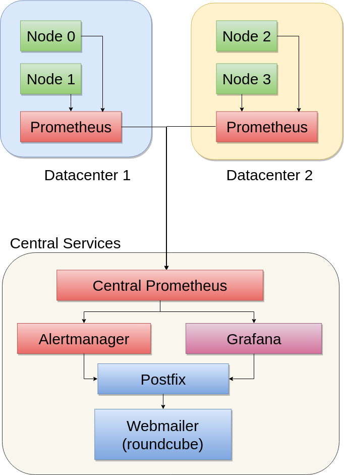

Prometheus Playground
---------------------

Here is a set of configuration files and a docker composition which allows you
to play around with the latest prometheus version without setting up everything
by hand again and again.

## Requirements
* docker
* docker-compose

## General

This repo contains a playground to evaluate different configs and behaviors of a prometheus based monitoring.
It uses Prometheus Node Exporter to expose data, Prometheus Server to capture them, Alert Rules in prometheus to define critical states, an Alertmanager to receive these alerts and forward them as mail to a Webmailer.
In addition there is a Grafana installed and connected as UI / Dashboard service.

The environment is splitted into two datacenters. Each contains two nodes and a prometheus server.
In addition there is a central prometheus instance which federates the data from the both datacenter prometheus servers.
In grafana you can add all three servers as datasource.

Credentials:
On the WebMailer you can login with any email adress and any password. If there was an email received to this address, you will see it. Default Mail where Notofication are sended to is "admin@playground.local".

On Grafana you can login by default with admin/admin.



### Node Exporter
We configured four nodes which will export data. Node0, Node1, Node2, Node3. Node0 is connected to your locale filesystem. Node1 and Node2 just running in docker and having the text exporter enabled for folder /node1/import and /node2/import. Node3 is a custome metric exporter written in python.
Every file you put there with the extension .prom will be taken and published to prometheus.

After starting the playground, you can reach
* node0 via http://localhost:9100/metrics
* node1 via http://localhost:9101/metrics
* node2 via http://localhost:9102/metrics
* node3 via http://localhost:9103/metrics.

There is a Node4 configured in DC2. Reason for that is to produce a permanent node down failure for testing purposes.

#### Node0
In the docker-compose file, node0 is prepared to mount local dev and proc folders, to show loacal data. It's commented out to enable the playground also to run on docker for Windows.
In addition you will find an "import" folder. Just put any *.prom file into it and the node will export it. The python script "consumptionExporter.py" create such an file via the PrometheusClient Libs. Just playaround with it.

#### Node1-Node2
These Nodes just running by default. They supporting also the *.prom files in the import directory. I use them to simulate erros like node down by just stopping them
``docker-compose stop node2``

#### Node3 - Custom Exporter
Instead of Node 0-2, where the image is downloaded from Internet, the image of Node 3 will be build locally with the command
``docker-compose build node3``

This copies the sourcecode of node3 into an image and make it locally available.
Hint: if you change the source code you must rebuild the image!
As an enhancement ypu maybe can use a shared folder (volume) for the source code.

Rebuild can be done by the build command above. To get the new image up and running, you must call ``docker-compose up node3`` which will result in a restart with latest image.


### Prometheus

As writen in the summary, there are three prometheus instances. The central prometheus is federating all datacenter prometheus instances in a 15 min. interval.
All instances are connected to the alert manager.

Alerts are configured in /etc/prometheus/alertrules/* . The rule - files must be enabled in the prometheus.yml on folder higher.

If an alert goes to a hard state. it will be send to the Alertmanager wich than can group and forward them.

To fire an alert just stop node 2 for some minutes.
``docker-compose stop node2``

The Central Prometheus is reachable via http://localhost:9090/ the DC1 via http://localhost:9091 and DC2 as http://localhost:9092.


### Alertmanager
The Alertmanager is configured to be triggered from prometheus.
The configuration can't be splitted to multiple files by default. To work more efficient in teams it make sense to separate the files and concatinate them in a pipeline or use tools like ansible.

The Script ``./alertmanager/testalerts.sh`` is firing a set of alerts which are handled by the different matchers and routes of the alert manager.

When you want to play only with these test alerts, then you can stop the nodes0-3, prometheus and grafana. The Alertmanager and the Mailserver + WebUI is suggested for such tests.

#### Notification templates
The Templates are based on Go Text Templating Engine.
These templates are supporting conditions and loops.

You will find more details here: https://godoc.org/text/template

The default templates are compiled into the sources, but they can be found here https://github.com/prometheus/alertmanager/blob/master/template/default.tmpl


### Grafana
Grafana is configured to load the data from prometheus.
In the existing config database the datasource is already configured.
When you delete the database and start the playground again, an empty db will be created. Then you have to configure prometheus as http://prometheus:9090/ as datasource.

### Mailserver
To check notifications we have installed GreenMail as Mail Server (mailserver) and Roundcube as Frontend (Webmailer). The Mailserver is listen on POrt 3025 (SMTP and 3143 for IMAP). The Webmailer can be reached on Port 9080 via the Browser.
This service is connected to all node exporters and to the Alertmanager.http://localhost:9080/
The Login name is the username you specified in the notification.
The Password is anything you type in.

In defaullt configuration you will receive notifications on *admin@playground.local* Please use that for login to see the messages.

## Usage
As it is a playground, all of the configurations are stored outside of the
containers.
The measured data and modified files for plugins etc are mostly stored also in
the in the repository folders, but they are not tracked on git. Just remove them
or make a fresh checkout to reset your playground.

### Start
The following command will check and start the environment:
````bash
#check configuration files
docker-compose config
# before the first start you should export the UID to get write access on fs
export PGUSER=$UID
# start the services
docker-compose up
````

As alternate (and simpler) way is to use the ``createPlayground.sh`` script,
which does the same.

### Play
Now you can open your browser and go to http://localhost:3000 to reach a
preconfigured grafana instance.

To see how Prometheus is performing, you can use this Dashboard: http://localhost:3000/d/6skUaNvik/prometheus-2-0-stats?refresh=1m&orgId=1


Additional Services:
* http://localhost:9090/ to reach Prometheus Central
* http://localhost:9091/ to reach Prometheus DC1
* http://localhost:9092/ to reach Prometheus DC2
* http://localhost:9100/metrics to reach Node 0 with local data export
* http://localhost:9103/metrics to reach Node 3
* http://localhost:9093/#/status for the alert manager
* http://localhost:9080/ to reach the mailserver

To reload a Prometheus configuration, please use the following command:
```bash
docker-compose restart prometheus
```

To interact with the container use
```bash
$ docker-compose exec -u=$UID grafana bash
```
Note: Some Containers supports only sh instead of bash.


#### Reference Documentation

#### Prometheus
https://prometheus.io/docs/
https://prometheus.io/docs/prometheus/latest/querying/examples/

##### Grafana
http://docs.grafana.org/

Configuration Values
http://docs.grafana.org/installation/configuration/

### Stop

To set the containers to pause use:
```bash
docker-compose stop
```
Restart can be done by using the "start" command.


### Delete
```bash
# remove a stopped environment
docker-compose rm -f
# stop and remove
docker-compose down
```

## Planned enhancements
Adding WebHook receiver and Nagios + Graphite
